# Transaction Reconciliation Engine

A high-performance, fault-tolerant Node.js & MongoDB service designed to ingest, normalize, and reconcile messy financial ledger records from disparate sources (`USER` and `EXCHANGE` tracking logs). It processes high-volume data streams via Node.js stream pipelining, guarantees exact mathematical accounting using `Decimal128` precision

---

## 1. Project Directory Structure

```text
├── src/
│   ├── config/
│   │   └── db.config.js          # MongoDB connection orchestration
│   ├── models/
│   │   ├── run.model.js          # Execution meta tracker
│   │   └── transaction.model.js  # Transaction schema
│   ├── controllers/
│   │   ├── reconcile.controller.js # Multi-stage orchestration trigger
│   │   └── report.controller.js    # Metric summary and CSV stream download
│   ├── routes/
│   │   ├── reconcile.route.js    # Routes for reconciliation service 
│   │   └── report.route.js       # Routes for summary and CSV data
│   ├── services/
│   │   ├── IngestionService.js   # CSV stream loader
│   │   ├── MatchingEngine.js     # Two-pass sliding-window pairing engine
│   │   └── reportService.js      # Report generation compiler
│   ├── utils/
│   │   └── normalizers.js        # Upper-case normalizers and asset alias 
├── app.js                        # Main entry point
├── .env.example                  # Environment fallback schema 
├── user_transactions.csv         # Raw input target dataset 1
└── exchange_transactions.csv     # Raw input target dataset 2
```

---

## 2. Key Architectural Decisions 

### Some of the architectural decisions taken are as follows - :


### A. High-Precision Decimal Math Guarantee

* **The Ambiguity:** JavaScript natively handles numbers via IEEE 754 floating-point standards, where arithmetic operations introduce rounding inaccuracies (e.g., $0.1 + 0.2 = 0.30000000000000004$).
* **The Decision:** All balance and token quantity variables are represented using MongoDB’s native **`Decimal128`** BSON type. When performing variance validation equations like:

$$\text{Variance \%} = \left( \frac{|Q_{\text{user}} - Q_{\text{exchange}}|}{Q_{\text{user}}} \right) \times 100$$


  values are explicitly cast and isolated dynamically to ensure exact compliance with financial reporting requirements.

### B. Logging the Malformed rows
* **The Ambiguity**: If rows fails during ingestion, how should we handle it
* **The Decision**: Logging the rows for now and in production Kafka/RabbitMQ can be used

### C. Algorithmic Optimization ($0(N \times M)$ to $0(N + M)$) 
* **The Ambiguity**: Simple nested matching loops cause execution times to scale quadratically, which triggers gateway timeouts or thread-locking bugs on large data sets. 
* **The Decision**: Implemented a Sliding Temporal Pointer Window matching algorithm. Since both the User and Exchange datasets are queried and sorted chronologically via database index scans (.sort({ timestamp: 1,_id:1 })), we track a floating window pointer (exchangeLeftWindowIdx). Once an exchange record falls behind the current user record's tolerance boundary, it is permanently abandoned. This prevents the inner loop from resetting to zero, compressing computational complexity down to linear time and saving significant CPU clock cycles. 

### D. Resolution of the Greedy Preemption Matching Bug

* **The Ambiguity:** If a user row finds an immediate, nearby matching exchange row with a divergent quantity, marking it as a conflict right away can break subsequent perfect matches.
* **The Decision:** We designed a **Two-Pass Discovery Engine**:

* **Pass 1 (Perfect Match Sweep):** Pinpoints and locks exact pairings within the time tolerance constraint ($T_{\text{tolerance}}$) and percentage quantity deviation ($\text{Pct}_{\text{tolerance}}$).
* **Pass 2 (Conflict Match Sweep):** Evaluates the remaining unassigned documents to catch rows within time-window boundaries that contain values exceeding your tolerance limits, safely flagging them as `CONFLICTING`.
This prevents sub-optimal greedy pairing, ensuring a lower false-negative rate.

### E. $O(1)$ Memory Footprint via Managed Backpressure

* **The Ambiguity:** Processing large transaction counts at once can cause a Node.js server's V8 engine to run out of RAM and crash.
* **The Decision:** The engine uses continuous streaming for both inputs and outputs:
1. **Ingestion:** Uses `fs.createReadStream` paired with explicit `pause()` and `resume()` hooks to manage backpressure while executing bulk database writes.
2. **Reporting:** Generates the reconciliation file line-by-line using `fast-csv` and pipes it directly into the Express HTTP response object (`res`). This maintains a flat $O(1)$ memory footprint regardless of file size.


### F. Idempotency & Crash-Recovery Strategy

* **The Ambiguity**: If the engine crashes halfway through an ingestion run, restarting it would generate a fresh runId, leading to massive database record duplication.
* **The Decision**: Created a Stateful Run Lifecycle using File Fingerprinting & Configuration Hashing. The engine constructs a unique signature for each execution based on the files' physical metadata (file name, exact byte size, and last modified timestamp) combined with the input tolerance configuration. On a rerun, the controller finds the incomplete run and reuses the exact same runId.
running out of memory.


---

## 3. Local Installation & Environmental Configuration

### Prerequisites

* **Node.js** (v16.x or higher recommended)

### Step 1: Clone the Project and Install Dependencies

Navigate to your project folder inside your terminal execution window and run:

```bash
npm install
```

### Step 2: Configure Environment Variables

Create a `.env` file in the root directory. Paste the configuration block below and adjust variables to match your database authentication paths:

```env
PORT=3000
MONGODB_URI=mongodb://127.0.0.1:27017/reconciliation_db

# Core Engine Fallback Defaults
TIMESTAMP_TOLERANCE_SECONDS=300
QUANTITY_TOLERANCE_PCT=0.01
```

### Step 3: Configure Input Documents

Download and place the input source documents `user_transactions.csv` and `exchange_transactions.csv` in the root of the folder

---

## 4. Execution & API Documentation

To spin up the web server engine in your local development workspace, run:

```bash
npm start
```

### Endpoints Overview

#### 1. Execute Reconciliation Run

* **Endpoint:** `POST /api/v1/reconcile`
* **Headers:** `Content-Type: application/json`
* **Payload (Optional overrides):**

```json
{
  "timestampToleranceSeconds": 600,
  "quantityTolerancePct": 0.05
}
```

* **Response (`200 OK`):**

```json
{
  "success": true,
  "runId": "664fa789b5321c1102948edf",
  "message": "Reconciliation analysis finalized successfully.",
}
```

#### 2. Fetch Run Summary Counts

* **Endpoint:** `GET /api/v1/report/:runId/summary`
* **Response (`200 OK`):**

```json
{
  "success": true,
  "runId": "664fa789b5321c1102948edf",
  "status": "COMPLETED",
  "summary": {
    "matchedCount": 22,
    "conflictingCount": 1,
    "unmatchedUserCount": 3,
    "unmatchedExchangeCount": 2
  }
}
```

#### 3. Fetch Unmatched Audit Records

* **Endpoint:** `GET /api/v1/report/:runId/unmatched`
* **Response (`200 OK`):**

```json
{
  "success": true,
  "runId": "664fa789b5321c1102948edf",
  "count": 1,
  "records": [
    {
      "externalId": "MALFORMED_ROW",
      "source": "USER",
      "timestamp": "2026-05-24T21:55:00.000Z",
      "asset": "UNKNOWN",
      "quantity": "0",
      "type": "BUY",
      "isValid": false,
      "validationErrors": [
        "Invalid quantity syntax: 'NULL' cannot be cast into a number."
      ],
      "matchingStatus": "UNMATCHED",
      "reconciliationReason": "No matching transaction found within time boundaries on Exchange records"
    }
  ]
}
```

#### 4. Stream Side-by-Side Reconciliation CSV File

* **Endpoint:** `GET /api/v1/report/:runId`
* **Behavior:** Instructs the client browser to immediately pull a streaming spreadsheet file download named `reconciliation_report_<runId>.csv`.
* **Output File Columns Structure:**
Pairs matching transaction profiles (User attributes vs. Exchange attributes) horizontally onto the exact same output row for easier analysis:
`Category`, `Reason`, `User_Tx_ID`, `User_Timestamp`, `User_Type`, `User_Asset`, `User_Quantity`, `User_Price_USD`, `User_Fee`, `Exchange_Tx_ID`, `Exchange_Timestamp`, `Exchange_Type`, `Exchange_Asset`, `Exchange_Quantity`, `Exchange_Price_USD`, `Exchange_Fee`.

-------


## System flow (Sequence Diagram) 

```mermaid
sequenceDiagram
    autonumber
    actor Client
    participant Express as Express Web Server
    participant IE as IngestionEngine
    participant ME as MatchingEngine
    participant RS as ReportService
    participant DB as MongoDB Cluster
    participant ID as InputDocuments
    participant CSV as fast-csv Formatter Stream

    %% PHASE 1: INGESTION
    Note over Express, DB: PHASE 1: Ingestion
    Client->>Express: POST /api/v1/reconcile/
    activate Express
    Express->>IE: ingestData(file,souce,runId)
    deactivate Express
    activate IE
    IE->>IE: Generate Deterministic Run Signature
    IE->>DB: Check for existing run signature
    activate DB
    DB-->>IE: Signature status (Exist / New)
    deactivate DB
    
    alt Signature already exists
        IE-->>Express: Halt Ingestion (Idempotent bypass)
        activate Express
        deactivate Express
    else Signature is New
        ID-->>IE: Instantiate stream of inputData (batchSize: 500)
        activate ID
        deactivate ID
        loop Process Ingestion Batches
            DB-->>IE: Stream Raw Documents
            activate DB
            loop For each document in batch
                IE->>IE: Validate Row Data & Generate Deterministic ID
            end
            IE->>DB: Transaction.bulkWrite({ordered: false})
            alt Bulk Write Error Occurs
                IE->>IE: Log Error (DLQ Production Fallback)
            end
        end
        deactivate DB
        IE-->>Express: Ingestion Task Completed Successfully
        activate Express
    end
    deactivate IE
    deactivate Express
    

    %% PHASE 2: MATCHING ENGINE
    Note over Express, DB: PHASE 2: The Matching Engine
    Express->>ME: reconcile(runId, config)
    activate Express
    deactivate Express
    activate ME
    ME->>ME: Parse & Normalize Input Tolerances
    ME->>DB: Transaction.find({ runId }).sort({ timestamp: 1 }).lean()
    activate DB
    DB-->>ME: Return lean sorted lists: userRecords & exchangeRecords
    deactivate DB

    loop Outer Loop: For each User Record (Oldest to Newest)
        alt userTx.isValid === false
            ME->>ME: Skip / Filter out Record
        else userTx.isValid === true
            ME->>ME: Normalize Parameters (Casing, exact float conversion)
            
            note over ME: Sliding Window Boundary Alignment
            loop While (uTime - eTime > pastTolerance)
                ME->>ME: Increment exchangeLeftWindowIdx forward (Permanently drop stale records)
            end
            
            note over ME: Time-Bounded Look-Ahead Scan
            loop From exchangeLeftWindowIdx until (eTime - uTime > futureTolerance)
                alt exchangeTx already claimed OR Asset/Type mismatch
                    ME->>ME: Skip exchange record iteration
                else Structural Constraints Valid
                    ME->>ME: Calculate absolute quantity variance %
                    alt Variance in boundaries & closest time difference
                        ME->>ME: Track as bestMatch (Temporal / Lowest Quantity Variance)
                    else Variance too high but Time/Asset matches
                        ME->>ME: Track as bestConflict (Log delta metadata string)
                    end
                end
            end
            
            alt bestMatch Found
                ME->>ME: Classify MATCHED (Claim exchangeId & queue Bulk Ops)
            else bestConflict Found
                ME->>ME: Classify CONFLICTING (Link IDs, queue Variance Metadata Ops)
            else No counterparty matches criteria
                ME->>ME: Classify UNMATCHED (Queue single user status payload)
            end
        end
    end

    ME->>ME: Sweep completely untouched remaining exchange records -> Mark UNMATCHED
    ME->>DB: Transaction.bulkWrite(bulkDbOps, { ordered: false })
    activate DB
    DB-->>ME: Concurrent Updates Saved
    deactivate DB
    ME->>DB: Update Run Summary Metrics in Run Document
    ME-->>Express: Reconcile Process Execution Summary JSON
    deactivate ME
    activate Express
    Express-->>Client: HTTP 200 OK (Process Completed)
    deactivate Express

    %% PHASE 3: REPORT GENERATION
    Note over Express, CSV: PHASE 3: Report Generation & Delivery
    Client->>Express: GET /api/v1/report/:runId
    activate Express
    Express->>DB: Run.findById(runId).lean()
    activate DB
    DB-->>Express: Run Document verification confirmed
    deactivate DB
    
    Express->>RS: generateFullCsvReport(runId, res)
    activate RS
    RS->>CSV: Instantiate csv.format({ headers: true })
    activate CSV
    RS->>CSV: .pipe(writableStream / Express HTTP Response)
    deactivate Express
    Note over CSV, Express: Direct Memory Bypass (Network Stream Attached)

    RS->>DB: Transaction.find({ runId }).lean()
    activate DB
    DB-->>RS: Return lightweight JavaScript raw object pool
    deactivate DB

    loop First-Pass Bulk Sweep & Memory Indexing
        RS->>RS: txMap.set(tx._id.toString(), tx) [O(1) Hash Map Optimization]
        alt tx.source === 'USER'
            RS->>RS: userRecords.push(tx)
        else tx.source === 'EXCHANGE' AND tx.matchingStatus === 'UNMATCHED'
            RS->>RS: unmatchedExchangeRows.push(tx)
        end
    end

    loop Phase 3 Sweep: Left-Side Join Projection (userRecords Processing)
        alt userTx.matchingStatus === 'UNMATCHED'
            RS->>RS: row = _formatReportRow('UNMATCHED_USER_ONLY', userTx, null)
            RS->>CSV: csvStream.write(row)
            CSV-->>Express: Flush text chunk immediately to client network
            activate Express
        else userTx contains pairedTxId
            RS->>RS: exchangeTx = txMap.get(userTx.pairedTxId) [Constant Time O(1) Fetch]
            alt exchangeTx exists in Map
                RS->>RS: processedExchangeIds.add(exchangeTx._id)
                RS->>RS: row = _formatReportRow(userTx.matchingStatus, userTx, exchangeTx)
                RS->>CSV: csvStream.write(row)
            else exchangeTx missing (Synchronization Anomaly Fallback)
                RS->>RS: row = _formatReportRow('UNMATCHED_USER_ONLY', userTx, null)
                RS->>CSV: csvStream.write(row)
            end
            CSV-->>Express: Flush text chunk immediately to client network
        end
    end

    loop Phase 4 Sweep: Residual Exchange Orphan Sweeping
        alt tx.source === 'EXCHANGE' AND matchingStatus != 'UNMATCHED'
            alt NOT processedExchangeIds.has(tx._id)
                RS->>RS: unmatchedExchangeRows.push(tx)
            end
        end
    end

    loop Phase 5 Sweep: Bottom-of-File Streaming
        RS->>RS: row = _formatReportRow('UNMATCHED_EXCHANGE_ONLY', null, exchangeOrphan)
        RS->>CSV: csvStream.write(row)
        CSV-->>Express: Flush text chunk immediately to client network
    end

    RS->>CSV: csvStream.end()
    CSV-->>Express: Close downstream pipes & flush buffers
    deactivate CSV
    RS-->>Express: Stream Resolution Finished
    deactivate RS
    Express-->>Client: Final HTTP 200 Chunk Sent (Reconciliation.csv Download Completed)
    deactivate Express
```


------------------------------

